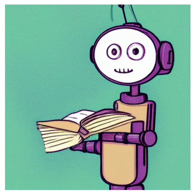

🧠 **Project Overview**

This project demonstrates image generation using pre-trained generative AI models. It converts text prompts into images using modern deep learning techniques.

🔬**Methods Used**

**1. Stable Diffusion with KerasCV**

Used for high-quality image generation from text prompts.

**2. DALL·E Mini**

A lightweight model used for quick image generation with lower computational cost.

**3. Aspect Ratio Variation**

Images were generated in different sizes (512×512, 768×512) to explore flexibility.

**4. Diffusion Colab**

Used pre-built notebooks for easier execution without setup.

🖼️ **Output**

This image was generated using Stable Diffusion with the prompt: "A cute robot reading a book"

📊 **Comparison**

| Model            | Quality | Speed  | Ease      |
| ---------------- | ------- | ------ | --------- |
| Stable Diffusion | High    | Medium | Medium    |
| DALL·E Mini      | Medium  | Fast   | Easy      |
| Colab Diffusion  | High    | Medium | Very Easy |

🚀 **Conclusion**

Pre-trained models simplify image generation. Stable Diffusion provides high-quality outputs, while DALL·E Mini offers faster but less detailed results. Colab-based solutions make implementation easier.
